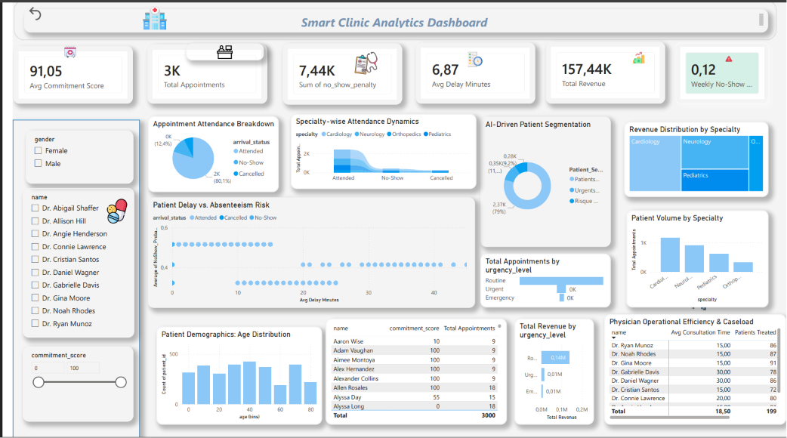

 Smart Clinic Analytics Dashboard (End-to-End BI & Machine Learning)


Welcome to the **Smart Clinic Analytics** repository! This end-to-end project showcases an executive-ready, clinic-themed Power BI dashboard integrated with **Python (Data Generation & Machine Learning)** to solve critical operational and clinical challenges in modern healthcare facilities.

## Final Dashboard Overview

The final dashboard is built using a cohesive clinical theme with structured, aligned grids and clear visual hierarchy:

*   **Executive KPIs (Top Row):** 
    *   **Patient Engagement Index:** `91.05` Average Commitment Score.
    *   **Total Booked Appointments:** `3K` total patient appointments.
    *   **Total Absenteeism Penalties:** `$7.44K` accumulated due to no-shows.
    *   **Average Patient Delay (Mins):** `6.87` minutes of delay on average.
    *   **Gross Realized Revenue:** `$157.44K` total generated revenue.
    *   **Weekly Absenteeism Rate:** `0.12` (12%) weekly no-show indicator.
*   **Column 1 (Left - Patient Insights):**
    *   `Appointment Attendance Breakdown` (Pie Chart)
    *   `Patient Delay vs. Absenteeism Risk` (Scatter Plot correlation)
    *   `Patient Demographics: Age Distribution` (Bar Chart)
*   **Column 2 (Center - AI & Operational Dynamics):**
    *   `Specialty-wise Attendance Dynamics` (Area Chart)
    *   `AI-Driven Patient Segmentation` (Donut Chart - K-Means Clustering)
    *   `Total Revenue by Urgency Level` (Dynamic Bar Chart)
*   **Column 3 (Right - Financial & Doctor Efficiency):**
    *   `Revenue Distribution by Specialty` (Treemap)
    *   `Patient Volume by Specialty` (Column Chart)
    *   `Physician Operational Efficiency & Caseload` (Doctor performance table containing Avg Consultation Time and Patients Treated)

---

## 🛠️ Project Architecture & Workflow

### 1. Data Engineering & Synthetic Generation (`generate_data.py`)
*   Engineered a realistic clinical dataset using Python simulating appointment structures, patient profiles, arrival statuses, and doctor shifts.

### 2. AI-Driven Patient Segmentation (K-Means Clustering)
*   Integrated a Python script using `scikit-learn`'s `KMeans` and `StandardScaler` inside Power Query to segment patients into three behavioral groups:
    *   **Patients Standards**
    *   **Risque de No-Show**
    *   **Urgents Fréquents**

---

##  Python Source Codes

### A. Data Generation Pipeline (`generate_data.py`)
```python
import pandas as pd
import numpy as np
from datetime import datetime, timedelta

# Configurations
num_rows = 5000
np.random.seed(42)

doctors = {
    "Dr. Abigail Shaffer": "Cardiology",
    "Dr. Allison Hill": "Neurology",
    "Dr. Angie Henderson": "Pediatrics",
    "Dr. Connie Lawrence": "Orthopedics",
    "Dr. Cristian Santos": "Cardiology",
    "Dr. Daniel Wagner": "Neurology",
    "Dr. Gabrielle Davis": "Pediatrics",
    "Dr. Gina Monroe": "Orthopedics"
}

doc_names = list(doctors.keys())

data = {
    "appointment_id": range(1001, 1001 + num_rows),
    "patient_id": np.random.randint(5000, 9999, size=num_rows),
    "age": np.random.randint(0, 95, size=num_rows),
    "gender": np.random.choice(["Male", "Female"], size=num_rows, p=[0.48, 0.52]),
    "doctor_name": np.random.choice(doc_names, size=num_rows),
    "appointment_date": [datetime(2026, 1, 1) + timedelta(days=int(np.random.randint(0, 180))) for _ in range(num_rows)],
    "arrival_status": np.random.choice(["Attended", "No-Show", "Cancelled"], size=num_rows, p=[0.75, 0.15, 0.10]),
    "urgency_level": np.random.choice(["Routine", "Urgent", "Emergency"], size=num_rows, p=[0.70, 0.22, 0.08]),
    "delay_minutes": np.random.exponential(scale=10, size=num_rows).astype(int)
}

df = pd.DataFrame(data)
df["specialty"] = df["doctor_name"].map(doctors)
df["commitment_score"] = df["arrival_status"].apply(lambda x: np.random.randint(80, 100) if x == "Attended" else np.random.randint(10, 50))

df.to_csv("synthetic_clinic_data.csv", index=False)
```

### B. Patient Clustering (K-Means inside Power Query)
```python
import pandas as pd
from sklearn.cluster import KMeans
from sklearn.preprocessing import StandardScaler

df = dataset.copy()

df['is_noshow'] = df['arrival_status'].apply(lambda x: 1 if str(x).strip().lower() == 'no-show' else 0)
df['is_urgent'] = df['urgency_level'].apply(lambda x: 1 if str(x).strip().lower() == 'urgent' else 0)

features = ['is_noshow', 'is_urgent']
scaler = StandardScaler()
X_scaled = scaler.fit_transform(df[features])

kmeans = KMeans(n_clusters=3, random_state=42, n_init=10)
df['Cluster_ID'] = kmeans.fit_predict(X_scaled)

cluster_mapping = {0: "Patients Standards", 1: "Risque de No-Show", 2: "Urgents Fréquents"}
df['Patient_Segment_AI'] = df['Cluster_ID'].map(cluster_mapping)

output = df.drop(columns=['is_noshow', 'is_urgent', 'Cluster_ID'])
```

---

##  Executive DAX Measures

### Weekly Absenteeism Rate
```dax
Weekly Absenteeism Rate = 
DIVIDE(
    CALCULATE(COUNTROWS('appointments'), 'appointments'[arrival_status] = "No-Show"),
    COUNTROWS('appointments'),
    0
)
```

### Dynamic Absenteeism Alert Color
```dax
Alert Color No-Show = 
IF([Weekly Absenteeism Rate] > 0.15, "#FF0000", "#00A86B")
```
